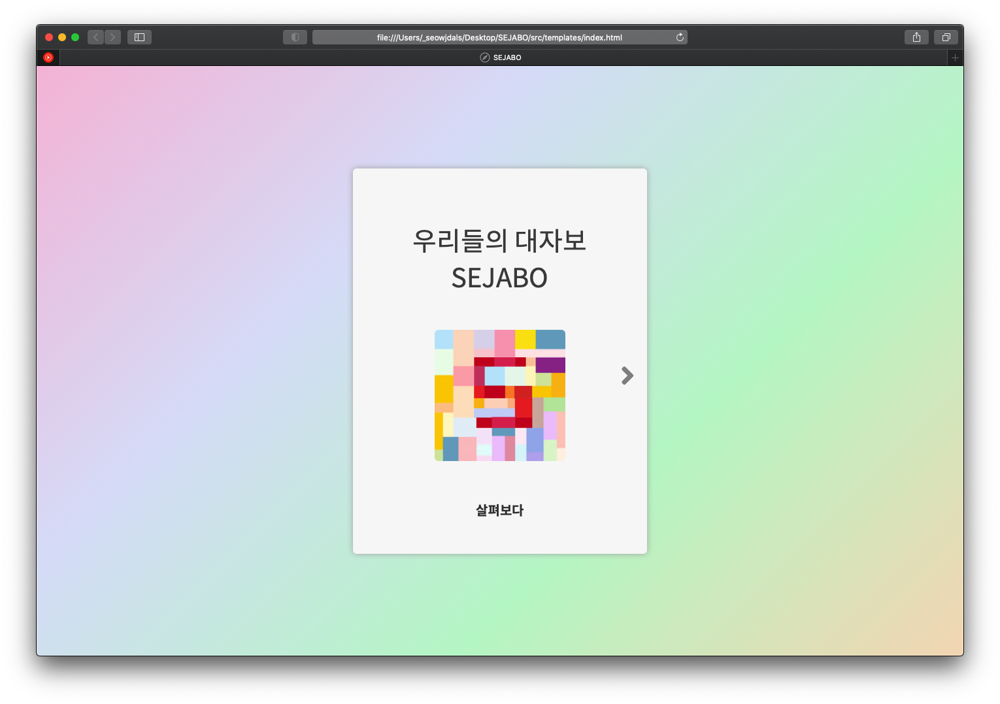

# SEJABO
> 세종대학교 전자식 대자보 시스템

<p></p>

세종대학교 재학생으로 이러한 의문이 들었습니다.

학교에는 전달해야 할 많은 정보들이 있습니다. 이러한 정보들은 주로 건물 외부/내부 벽 혹은 흡연 부스 및 대자보 등 과 같은 곳에서 게시되고 있습니다. 하지만 이러한 게시물들은 전혀 관리가 안되는 상황이었고 비가오는 날에는 다 젖어 찢어지기 마련이었습니다.

이러한 문제점을 보면서 착안한 아이디어가 바로 세종대학교 전자식 대자보인 SEJABO 것이죠.

## Needs

- Python 3.X
- MySQL 5.7.X
- Web Browser

## Installation

OS X & Linux:

```sh
git clone https://github.com/837477/SEJABO.git
```

Windows:

```sh
git clone https://github.com/837477/SEJABO.git
```

Development setup:

```sh
pip install -r requirement.txt
```

## Usage example

Execution:

```sh
python3 app.py
```

<p></p>

세자보는 Flask 기반의 웹 서비스 입니다.

### 주요 기능

- 회원 가입 / 로그인
- 게시글 관리 (관리자)
- 게시글 조회 및 좋아요
- 건물 별 카테고리 구분
- 검색
- 실시간 새로고침

## Release History

* 0.0.1
    * Work in progress

## Meta

🙋🏻‍♂️ Name: 837477 

📧 E-mail: 8374770@gmail.com

📔 Blog: http://837477.pythonanywhere.com

🐱 Github: https://github.com/837477

## Contributing

1. Fork it (<https://github.com/837477/SEJABO>)
2. Create your feature branch (`git checkout -b feature/fooBar`)
3. Commit your changes (`git commit -am 'Add some fooBar'`)
4. Push to the branch (`git push origin feature/fooBar`)
5. Create a new Pull Request
